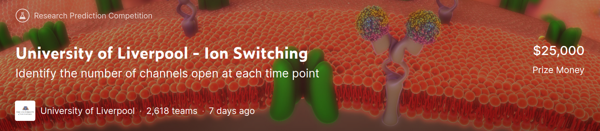

# Liverpool Ion Switching
In this [repository](https://github.com/stdereka/liverpool-ion-switching) you can find an outline of how to reproduce my 2nd place solution for [Liverpool Ion Switching](https://www.kaggle.com/c/liverpool-ion-switching/) competition.
It contains all the code and pipelines I used to create my winning submissions.
If you run into any trouble with the setup/code or have any questions please contact me at [st.dereka@gmail.com](st.dereka@gmail.com).

In `./summary.pdf` you can find a detailed model description.

[Post](https://www.kaggle.com/c/liverpool-ion-switching/discussion/153991), which explains my approach to the challenge.

Kaggle [kernel](https://www.kaggle.com/stdereka/2nd-place-solution-preprocessing-tricks) illustrating my preprocessing and data augmentation strategies.

## Contents

* `./preprocessing` - preprocessing scripts
* `./data` - raw and preprocessed data
* `./config` - configuration files (.json)
* `./models` - serialized copies of models and their predictions
* `./model` - train and inference pipelines of models
* `./postprocessing` - code to write submissions and do some postprocessing
* `./submissions` - final submissions
* `./evaluation` - utilities to compute model's CV metrics

## Software requirements

1. Python 3.6.9
2. CUDA 10.1
3. Nvidia Driver 418.67
4. Python packages are detailed in `./requirements.txt`. In order to install them run:

        pip install -r requirements.txt

5. Ubuntu 18.04 LTS (it is not necessary to have exactly this OS installed, you can run the
solution almost on any modern Linux distribution)

## Hardware requirements (recommended)
These requirements should be fulfilled if you want to retrain all models from scratch.
Running prediction with pretrained models consumes less resources - you don't even need a GPU.

1. 30 GB free disk space
2. 20 GB RAM
3. 1 x Tesla P100-PCIE-16GB
4. Intel Core i7-3720QM

## Entry points

To make reproducing easier I created following scripts:

* `./prepare_data.py` - reads parameters from `./config/PREPROCESSING.json` and runs preprocessing pipeline
* `./train.py` - reads parameters from `./config/RFC.json` and `./config/WAVENET.json`, runs training pipelines
* `./predict.py` - reads parameters from `./config/RFC.json` and `./config/WAVENET.json`, runs inference pipelines and writes submissions.
* `./run_all_in_colab.ipynb` - allows to reproduce all the results on Google Colab

## How to reproduce the results?

The most simple way to reproduce the results is to run
`./run_all_in_colab.ipynb` on Google Colab. I prepared this entry point
to make the process as simple as possible. If you want to reproduce the
results on your local machine, follow these steps:

1. Clone the repo:

        git clone https://github.com/stdereka/liverpool-ion-switching.git
        cd liverpool-ion-switching

2. Download the data and pretrained models. Assumed, that you have [Kaggle API](https://github.com/Kaggle/kaggle-api) installed
and `kaggle.json` is generated and placed in appropriate directory.
If you are the competition host, you can skip this step - all necessary data is in the package.
Run:

        ./download_data.sh

3. Run preprocessing pipeline:

        python prepare_data.py

4. In order to reproduce two final submissions, run inference pipeline.
Depending on your hardware, it will take about 10 minutes. Reproducing 
results is extremely simple: you don't even need a GPU. Two generated
submissions in `./submissions` directory reproduce my final LB score
within a reasonable margin. Run following command:

        python predict.py --all

5. Retraining the models from scratch will take much more time and 
hardware resources. If you want to do it I suggest two options.

   1. Retrain only wavenet models on GPU (2nd layer of stacking).
   It takes 6-9 hours. Run:
   
            python train.py --wavenet
   
   2. Retrain all the models including RFCs and wavenets. It can take
   more than one day with hardware setup I described above. Run:
   
            python train.py --rfc --wavenet

